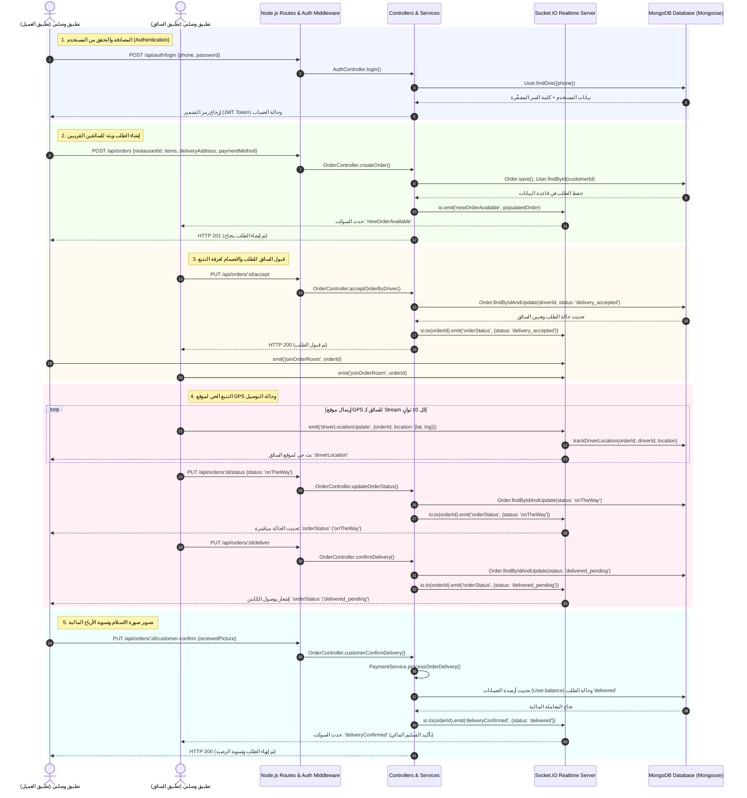

```mermaid
sequenceDiagram
    autonumber
    actor Customer as تطبيق وصلني (تطبيق العميل)
    actor Driver as تطبيق وصلني (تطبيق السائق)
    participant API as Node.js Routes & Auth Middleware
    participant Controller as Controllers & Services
    participant Socket as Socket.IO Realtime Server
    participant DB as MongoDB Database (Mongoose)

    %% 1. تسجيل الدخول والمصادقة
    rect rgb(240, 245, 255)
    note right of Customer: 1. المصادقة والتحقق من المستخدم (Authentication)
    Customer->>API: POST /api/auth/login {phone, password}
    API->>Controller: AuthController.login()
    Controller->>DB: User.findOne({phone})
    DB-->>Controller: بيانات المستخدم + كلمة السر المشفّرة
    Controller-->>Customer: إرجاع رمز التشفير (JWT Token) وحالة الحساب
    end

    %% 2. إنشاء الطلب وإشعار السائقين
    rect rgb(245, 255, 240)
    note right of Customer: 2. إنشاء الطلب وبثه للسائقين القريبين
    Customer->>API: POST /api/orders {restaurantId, items, deliveryAddress, paymentMethod}
    API->>Controller: OrderController.createOrder()
    Controller->>DB: Order.save(), User.findById(customerId)
    DB-->>Controller: حفظ الطلب في قاعدة البيانات
    Controller->>Socket: io.emit('newOrderAvailable', populatedOrder)
    Socket-->>Driver: حدث السوكت: 'newOrderAvailable'
    Controller-->>Customer: HTTP 201 (تم إنشاء الطلب بنجاح)
    end

    %% 3. قبول الطلب والانضمام لغرفة التتبع المباشر
    rect rgb(255, 250, 240)
    note right of Driver: 3. قبول السائق للطلب والانضمام لغرفة التتبع
    Driver->>API: PUT /api/orders/:id/accept
    API->>Controller: OrderController.acceptOrderByDriver()
    Controller->>DB: Order.findByIdAndUpdate(driverId, status: 'delivery_accepted')
    DB-->>Controller: تحديث حالة الطلب وتعيين السائق
    Controller->>Socket: io.to(orderId).emit('orderStatus', {status: 'delivery_accepted'})
    Controller-->>Driver: HTTP 200 (تم قبول الطلب)

    Customer->>Socket: emit('joinOrderRoom', orderId)
    Driver->>Socket: emit('joinOrderRoom', orderId)
    end

    %% 4. التتبع المباشر لموقع السائق وحالة الرحلة
    rect rgb(255, 240, 245)
    note right of Driver: 4. التتبع الحي لموقع GPS وحالة التوصيل
    loop إرسال موقع GPS للسائق كـ Stream كل 10 ثوانٍ
        Driver->>Socket: emit('driverLocationUpdate', {orderId, location: {lat, lng}})
        Socket->>DB: trackDriverLocation(orderId, driverId, location)
        Socket-->>Customer: بث حي لموقع السائق: 'driverLocation'
    end

    Driver->>API: PUT /api/orders/:id/status {status: 'onTheWay'}
    API->>Controller: OrderController.updateOrderStatus()
    Controller->>DB: Order.findByIdAndUpdate(status: 'onTheWay')
    Controller->>Socket: io.to(orderId).emit('orderStatus', {status: 'onTheWay'})
    Socket-->>Customer: تحديث الحالة مباشرة: 'orderStatus' ('onTheWay')

    Driver->>API: PUT /api/orders/:id/deliver
    API->>Controller: OrderController.confirmDelivery()
    Controller->>DB: Order.findByIdAndUpdate(status: 'delivered_pending')
    Controller->>Socket: io.to(orderId).emit('orderStatus', {status: 'delivered_pending'})
    Socket-->>Customer: إشعار بوصول الكابتن: 'orderStatus' ('delivered_pending')
    end

    %% 5. تأكيد الاستلام وتسوية المحفظة الرصيدية
    rect rgb(240, 255, 255)
    note right of Customer: 5. تصوير صورة الاستلام وتسوية الأرباح المالية
    Customer->>API: PUT /api/orders/:id/customer-confirm {receivedPicture}
    API->>Controller: OrderController.customerConfirmDelivery()
    Controller->>Controller: PaymentService.processOrderDelivery()
    Controller->>DB: تحديث أرصدة الحسابات (User.balance) وحالة الطلب 'delivered'
    DB-->>Controller: نجاح المعاملة المالية
    Controller->>Socket: io.to(orderId).emit('deliveryConfirmed', {status: 'delivered'})
    Socket-->>Driver: حدث السوكت: 'deliveryConfirmed' (تأكيد التسليم المالي)
    Controller-->>Customer: HTTP 200 (تم إنهاء الطلب وتسوية الرصيد)
    end
```